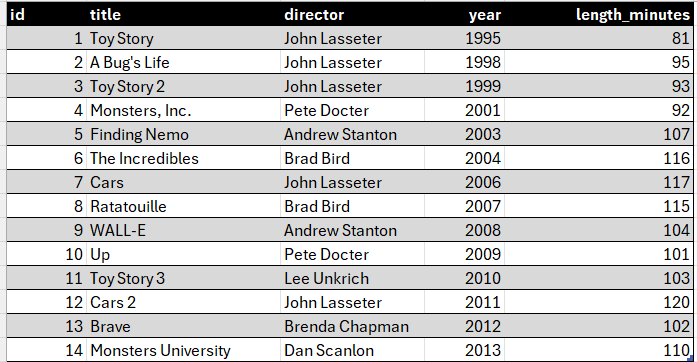

### SQL Bolt 

#### Learn SQL with simple, interactive exercises.

#### [01. Find the title of each film](scripts/01-Find_the_title_of_each_film.sql).

#### 02. Find the director of each film

#### 03. Find the title and director of each film

#### 04. Find the title and year of each film

#### 05. Find all the information about each film

